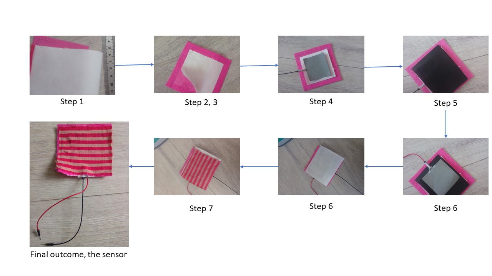

## Name: H T M A Riyadh
## Course: Interactive System, Saarland University
# Project Title 
Force Sensitive Textile (FST): An e-Textile for sensing the applied pressure on body to measure motor-neurological response in Glasgow Coma Scale (GCS)
# Project Concept
Glasgo Coma Scale is used to asses a patient's consciousness level based on the neurological scale. Emergency medical services, nurses, physicians use GCS for assessing consciousness of patients mainly neck/head injured or trauma patients. The score level is 1 to 15. It is the initial stage of assessing neurological injured also known as traumatic brain injury patients. There are three main elements for this scale: eye, verbal and motor response. In this project I only consider the pressure input that is related to the eye and motor response. Verbal response is out of scope of this project.
So the idea is very simple. We need to measure the applied pressure on the patient’s limbs and the patient's response to the stimuli. As it is the initial or first step assessment of the traumatized patient, so this pressure measurement should be flexible and easily set up. So, I proposed a smart cloth that can able to measure the external pressure applied on it. FST has the ability to measure the pressure applied on it. Simple wearable arm/wrist band or t shirt needs to wear by the patient. The doctor then needs to give pressure or hit on the pressure point covering by the FST. So, the clothes measure how much pressure applied by the physician and doctor also observes the response of the patients. Based on the applied pressure level, and response, the neurological scale can be mapped and give the output result. Thus studying the patients, we can make a universal scale in accordance with each level of pressure i.e. eye blink for Level 2 pressure. 
# List of materials
1. Arduino Uno
   - Connect the sensor to the monitor 
   - Take the input 
   - Display the output 
2. Non-conductive, thin fabric
   - It will use for outer layer of the sensor
3. Non-conductive, thicker fabric
   - It will give the strength to the sensor
   - Make the structure of the sensor
4. Conductive fabric
   - For making the Anode and Cathode of the sensor. 
   - Passing the electric signal 
5. Piezo-resistive fabric
   - Give the resistance of the sensor 
6. Dual sided bonding material
   - Attaching the 1-5 materials together
7. Alligator clips
   - Helps to connect the sensor end to the Arduino 
8. Scissors
   - For cutting the materials 
9. Iron
   - It will be use the iron the cloth after applying the wax paper and glue. 
   - Attach the glued cloth layer strongly
10. Wax-paper
    - For separating the conductive layer from cloths 
    - Help to reassemble later.
11. Wire/Jumper/Cable
    - Connect the Micro-controller to the monitor/computer 
12. Monitor
    - Display the output result 
13. RGB LED (optional)
    -  Indicating the pressure level according to color coding: green(Low) to red(High)

# The sensor
We need a sensor that can measure the pressure/force or pressure sensitive. I proposed smart e-Fabric, that can able to measure the pressure applied on it. To implement this type of intelligent, clothe sensor, we need conductive and piezo resistive textile fabric. This type of clothes already available on the market. We need the following components are needed to make our pressure sensor.
- Non-conductive fabric for outer layer. For the top layer, glue must be bottom face and the Bottom layer, glue must be up face.
- Non-conductive thicker fabric for making the structure of the sensor and it must be non-elastic. 
- Conductive Fabric. It should not be elastic. 
- Piezo-resistive Fabric. It is highly conductive and pressure sensitive.
- Both side bonded tape or clothes that can attach all the clothes together.

# Steps of making sensor (prototype)
1. Cut out a piece of bonding material (Iron on glue) about the same size of the material I intended to use
2. Then place the fabric(non conductive) and on top of that place bonding material
3. Start ironing them so that they bond together, then take of the paper from the top of bonding material
4. Place the conductive material on top of it and start iron for 6-8 seconds. (So we have conductive material bonding with the non conductive material)
5. Now place a resistive material on it. Remember no glue will be attached to resistive to conductive material
6. On top of it, place second conductive material and ten followed by a bonding material.
7. Then, on top of it place non conductive material and iron on it. 
See the image below:

 Figure: Sensor layout 

 Figure: Steps of making the sensor 

#Circuit design

 Figure: circuit design 

